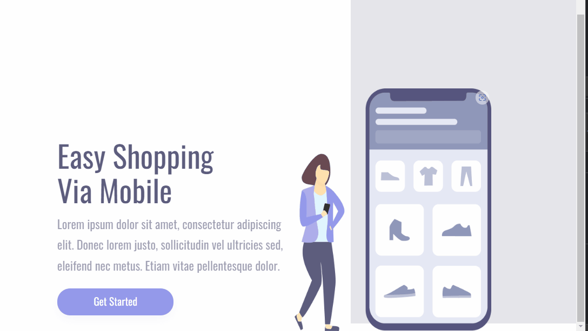

### Projeto desenvolvido pelo Mentor Rodolfo Mori no curso  DevClub 🚀

### Desafio tornar site responsivo, Adapatar para telas menores

[]

 
 

### Tecnologias Utilizadas

  

  
  

### Projeto Desenvolvido por Márcia😊

